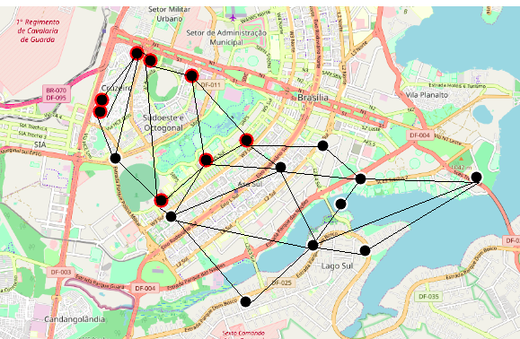
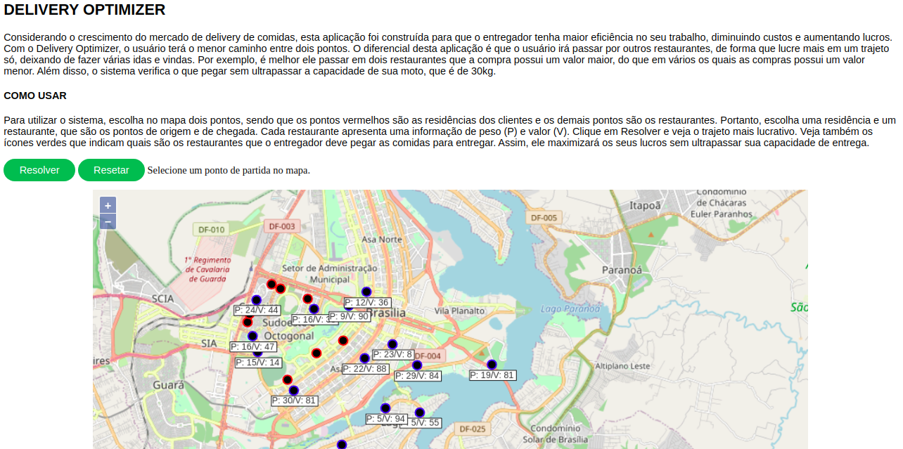
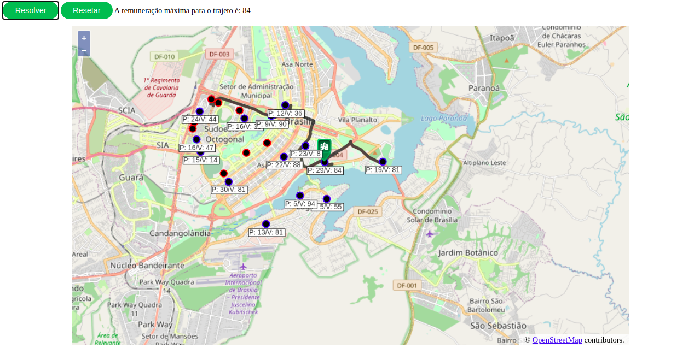
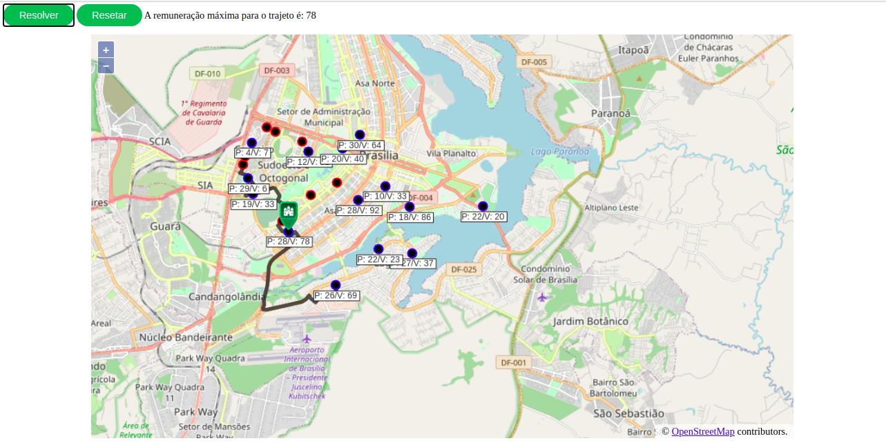

# DELIVERY OPTIMIZER

**Número da Lista**: 6 
**Conteúdo da Disciplina**: Trabalho Final 

## Alunos
|Matrícula | Aluno |
| -- | -- |
| 16/0014433  |  Maria Luiza Ferreira Assumpção Almeida |
| 15/0009313  |  Felipe de Oliveira Hargreaves |

## Sobre 
Considerando o crescimento do mercado de delivery de comidas, esta aplicação foi construída para que o entregador tenha maior eficiência no seu trabalho, diminuindo custos e aumentando lucros. Com o Delivery Optimizer, o usuário terá o menor caminho entre dois pontos. O diferencial desta aplicação é que o usuário irá passar por outros restaurantes, de forma que lucre mais em um trajeto só, deixando de fazer várias idas e vindas. Por exemplo, é melhor ele passar em dois restaurantes que a compra possui um valor maior, do que em vários os quais as compras possui um valor menor. Além disso, o sistema verifica o que pegar sem ultrapassar a capacidade de sua moto, que é de 30kg.

Para a construção do projeto foram utilizados dois algoritmos, sendo um deles o Algoritmo de Dijkstra, que foi usado para encontrar o menor caminho entre dois pontos e o Algoritmo da Mochila para verificar os pesos e o valor de cada restaurante, com o objetivo de maximizar o valor sem ultrapassar o peso máximo. Para isso, foi construído o grafo abaixo ligando os pontos para formar os caminhos possíveis. Ademais, foi utilizada a biblioteca Openlayers para a construção do mapa e visualização das rotas possíveis. Os valores e os pesos de cada restaurante são gerados aleatoriamente, o que pode alterar o resultado a cada execução.

## Screenshots

#### Visão Geral 

#### Exemplos de Rotas

## Instalação 
**Linguagem**: Python e HTML/JS 
  1. Instalar as dependências com `pip install -r requirements.txt`. [Instruções para instalação do Pip, caso já não esteja instalado.](https://pip.pypa.io/en/stable/installing/)
  2. Executar o comando `python server.py` ou `python3 server.py`. 
  3. Abrir o navegador e acessar `localhost:5000`

## Uso 
Para utilizar o sistema, escolha no mapa dois pontos, sendo que os pontos vermelhos são as residências dos clientes e os demais pontos são os restaurantes. Portanto, escolha um restaurante e uma residência, que são os pontos de origem e de chegada. Cada restaurante apresenta uma informação de peso (P) e valor (V). Clique em Resolver e veja o trajeto mais lucrativo. Veja também os ícones verdes que indicam quais são os restaurantes que o entregador deve pegar as comidas para entregar. Assim, ele maximizará os seus lucros sem ultrapassar sua capacidade de entrega.

